# Wazuh SIEM Home Lab

## Overview

This is a self-built Security Information and Event Management (SIEM) lab, running [Wazuh](https://wazuh.com) on a local VirtualBox VM, put together to learn how a SIEM actually works end to end rather than just reading about it. That meant standing up the platform itself, enrolling a real endpoint, working through File Integrity Monitoring and real vulnerability data, and building a custom log source integration for GitHub from scratch (the centerpiece of this repo) after discovering Wazuh's built-in GitHub module is gated behind a paid GitHub plan I don't have.

Everything below is documented as it actually happened, including the parts that didn't fully work (see [File Integrity Monitoring](#file-integrity-monitoring)), because the troubleshooting is as much the point of a lab like this as the finished result.

**What's inside:**

- A working Wazuh manager and dashboard, reachable from the host machine via VirtualBox port forwarding
- A macOS Wazuh agent, enrolled and actively reporting
- File Integrity Monitoring, configured and investigated end to end (partially inconclusive, documented honestly rather than glossed over)
- Vulnerability Detection, explored against real flagged CVEs on the lab agent
- A from-scratch GitHub integration: an org webhook, an ngrok tunnel, a small Python listener, a Wazuh `localfile` block, and a custom alerting rule, replacing the native module that GitHub's Enterprise Cloud requirement blocks

The GitHub piece is the only part that's fully scripted and reproducible (see [`scripts/`](scripts)). The VM and dashboard setup below is a walkthrough of what was done, since it's mostly point-and-click through VirtualBox and the Wazuh dashboard rather than something you'd script.

## Contents

- [Lab environment](#lab-environment)
- [Agent deployment](#agent-deployment)
- [File Integrity Monitoring](#file-integrity-monitoring)
- [Vulnerability Detection](#vulnerability-detection)
- [GitHub integration](#github-integration)
- [Repo structure](#repo-structure)
- [Setup (GitHub integration)](#setup-github-integration)
- [Troubleshooting notes](#troubleshooting-notes)
- [Security notes](#security-notes)

## Lab environment

The manager runs in a VirtualBox VM (Wazuh's OVA appliance, indexer, manager, and dashboard all in one guest). VirtualBox's default networking is NAT, which means nothing outside the VM can reach it by default, so the first real piece of infrastructure work was port forwarding on the VM's Network settings:

| Host port | Guest port | Purpose |
|---|---|---|
| 8443 | 443 | Dashboard (HTTPS) |
| 1515 | 1515 | Agent enrollment |
| 1514 | 1514 | Agent event traffic |

With that in place, the dashboard becomes reachable at `https://localhost:8443` from the host machine, and agents on the host (or elsewhere on the LAN) can enroll and ship data to `127.0.0.1` on the mapped ports.

Wazuh's own architecture, for reference: the **indexer** (OpenSearch under the hood) stores and searches everything, the **manager** runs `analysisd` (the rule engine) and receives agent traffic, **Filebeat** ships parsed data from the manager into the indexer, and the **dashboard** (OpenSearch Dashboards) is the web UI on top of it all.

## Agent deployment

Deployed the Wazuh agent onto a macOS host and pointed it at the manager:

```bash
curl -so wazuh-agent.pkg https://packages.wazuh.com/4.x/macos/wazuh-agent-4.14.7-1.arm64.pkg
echo "WAZUH_MANAGER='127.0.0.1'" > /tmp/wazuh_envs
sudo installer -pkg ./wazuh-agent.pkg -target /
```

`WAZUH_MANAGER` tells the installer where to enroll. It's `127.0.0.1` because of the port forwarding above. The agent's traffic on 1514/1515 gets forwarded straight into the VM from there. After install, confirmed all five agent-side daemons came up (`wazuh-modulesd`, `wazuh-logcollector`, `wazuh-syscheckd`, `wazuh-agentd`, `wazuh-execd`) and the agent showed **Active** in the dashboard's Agents view.

Once enrolled, spent time in the dashboard's **Threat Hunting** view getting familiar with what a healthy agent's baseline activity actually looks like, and learning the practical distinction between a SIEM (aggregates and correlates security data across many sources, which is what Wazuh is), an XDR (extends that with active cross-tool response), and an EDR (endpoint-only detection and response), useful vocabulary for understanding where Wazuh sits relative to other security tooling.

## File Integrity Monitoring

Tried to get a live FIM alert end to end: added a custom watched directory under `<syscheck>` in the agent's `ossec.conf` with `realtime="yes" report_changes="yes"`, dropped the scan `<frequency>` down to 60s for faster iteration, granted the agent binary Full Disk Access in macOS's Privacy settings (required for realtime FSEvents-based monitoring), and confirmed rule descriptions like "Integrity checksum changed" genuinely exist in the manager's ruleset (`ruleset/rules/0015-ossec_rules.xml`).

Despite all of that lining up, no syscheck alert ever appeared in `alerts.log`, only in the newer **Inventory** tab, which is backed by a different, database-synchronization-based FIM pipeline in current Wazuh versions, separate from the classic rule/decoder path those alert rules expect. Ruled out the usual suspects along the way, including clock skew throwing off the dashboard's search window, checking the wrong log file (`ossec.log` vs `alerts.log`), and missing ruleset files, before landing on that architecture-mismatch theory. Didn't chase it further into `analysisd` debug logging. Documenting it here as an open thread rather than a solved one, and moved on deliberately rather than burning more time on it.

## Vulnerability Detection

Spent time in the **Vulnerability Detection** module going through real flagged CVEs on the lab agent: learning to read a CVSS vector string (e.g. `CVSS:3.1/AV:L/AC:L/PR:N/UI:R/S:U/C:H/I:N/A:N`) and what each field means (attack vector, attack complexity, privileges required, user interaction, scope, and the confidentiality/integrity/availability impact triad), and working through the CWE (Common Weakness Enumeration) categories that showed up across the flagged packages, things like integer/buffer overflow, out-of-bounds read/write, use-after-free, type confusion, race conditions, memory corruption, information disclosure, authorization/permissions issues, path traversal, injection, parsing issues, and inconsistent-state issues, and why each one gets classified as a genuine vulnerability by weighing it against the CIA triad (does it threaten confidentiality, integrity, or availability).

## GitHub integration

This is the piece with actual scripts and a reproducible setup, detailed below.

### The blocker

Wazuh ships a native `<wodle name="github">` module that polls GitHub's organization audit-log REST API (`GET /orgs/{org}/audit-log`). That endpoint is restricted to orgs on **GitHub Enterprise Cloud**. On a free/Team org it returns a 404, even with a correctly scoped token:

```json
{"message":"Not Found","documentation_url":"https://docs.github.com/rest/orgs/orgs#get-the-audit-log-for-an-organization","status":"404"}
```

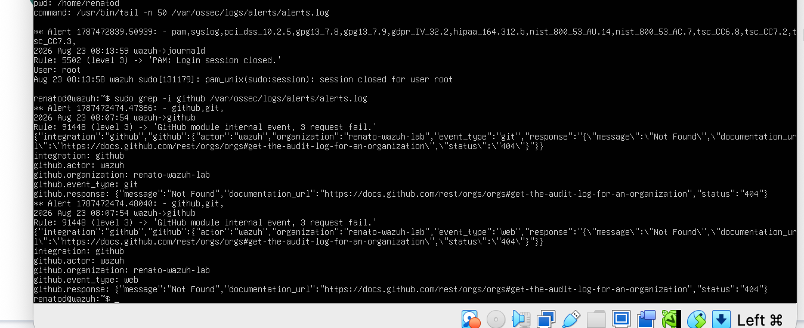

The manager-side "Cloud Security → GitHub" dashboard confirms it: the wiring is correct, but there's nothing to show, since the underlying API call never succeeds.

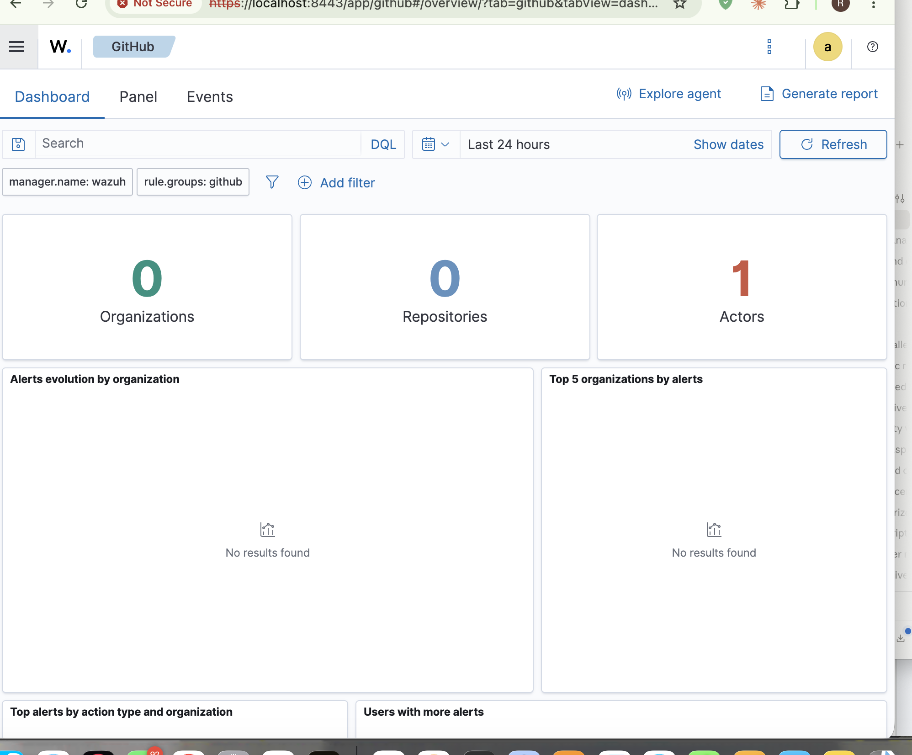

### The fix: push instead of poll

Webhooks are available on every GitHub plan. So instead of Wazuh polling an API it doesn't have access to, GitHub pushes events out directly:

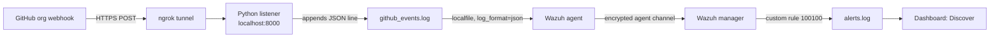

Since the machine running the listener sits behind NAT with no public IP, [ngrok](https://ngrok.com) provides the public URL, tunneling straight back to a local port. Every event a GitHub webhook can fire (member invited, repo created, settings changed, and so on) travels this exact path, and nothing about it requires a paid GitHub plan.

## Repo structure

```
.
├── scripts/
│   ├── mac/
│   │   ├── install_ngrok.sh      # installs ngrok without Homebrew
│   │   ├── webhook_listener.py   # receives + logs webhook deliveries
│   │   ├── start_listener.sh     # runs listener + ngrok, prints the public URL
│   │   └── configure_agent.sh    # adds the <localfile> block, restarts agent
│   ├── manager/
│   │   ├── add_custom_rule.sh    # adds rule 100100, restarts manager
│   │   └── enable_archiving.sh   # optional: turns on logall for debugging
│   └── github/
│       └── create_org_webhook.sh # registers the org webhook via GitHub's API
├── config/
│   ├── localfile_snippet.xml     # the exact agent config block, for manual use
│   └── local_rules_snippet.xml   # the exact manager rule, for manual use
└── screenshots/                  # this lab's actual run, in order
```

## Setup (GitHub integration)

**Prerequisites:** a Wazuh manager (built against 4.14.7) with at least one enrolled agent, a GitHub organization you own or admin, a free [ngrok](https://ngrok.com) account, and `python3` on the machine running the listener (stdlib only, no third-party packages).

**1. Install and authorize ngrok** (on the machine that will run the listener):

```bash
./scripts/mac/install_ngrok.sh
ngrok config add-authtoken <your-authtoken>   # from https://dashboard.ngrok.com
```

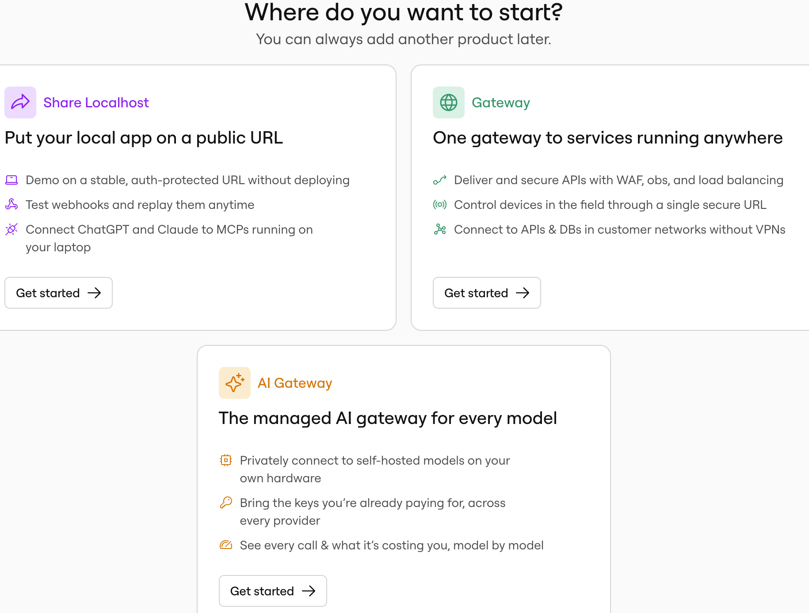

**2. Start the listener + tunnel:**

```bash
./scripts/mac/start_listener.sh
```

Backgrounds both the Python listener and `ngrok http 8000`, then reads ngrok's local API to print the public URL automatically:

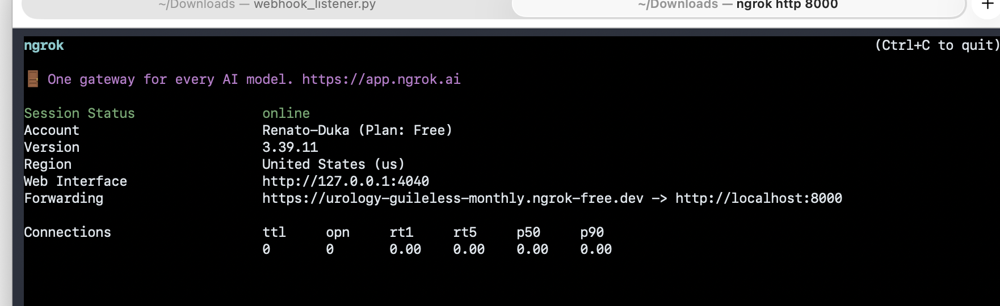

**3. Register the webhook.** Either let the script do it:

```bash
export GITHUB_TOKEN=ghp_xxx        # needs admin:org (classic) or the org "Webhooks" permission
export GITHUB_ORG=your-org-login
export WEBHOOK_URL=https://xxxx.ngrok-free.dev   # printed by start_listener.sh
./scripts/github/create_org_webhook.sh
```

or create it by hand under **Org Settings → Webhooks → Add webhook**, content type `application/json`, events set to "Send me everything."

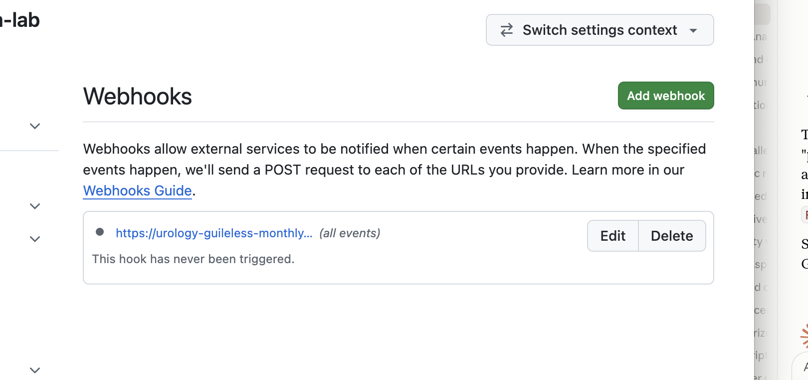

GitHub fires an automatic `ping` event the moment the webhook is saved. It shows up on both ends. The listener catches it locally, and GitHub's own delivery log confirms it went out successfully:

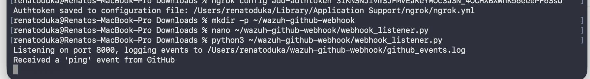
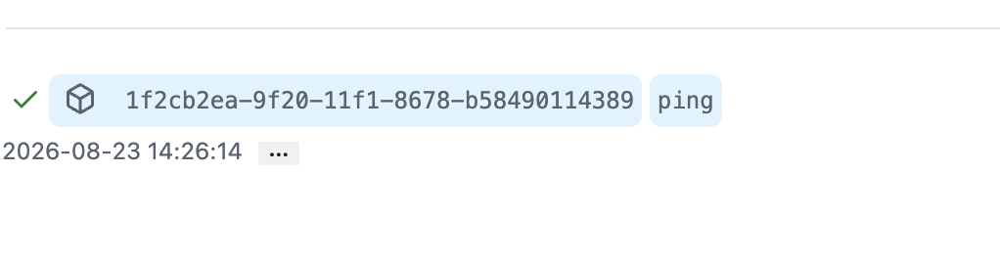

**4. Point the Wazuh agent at the log file:**

```bash
sudo ./scripts/mac/configure_agent.sh
```

**5. Add the alerting rule on the manager:**

```bash
sudo ./scripts/manager/add_custom_rule.sh
```

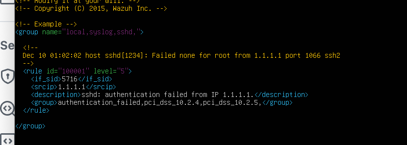
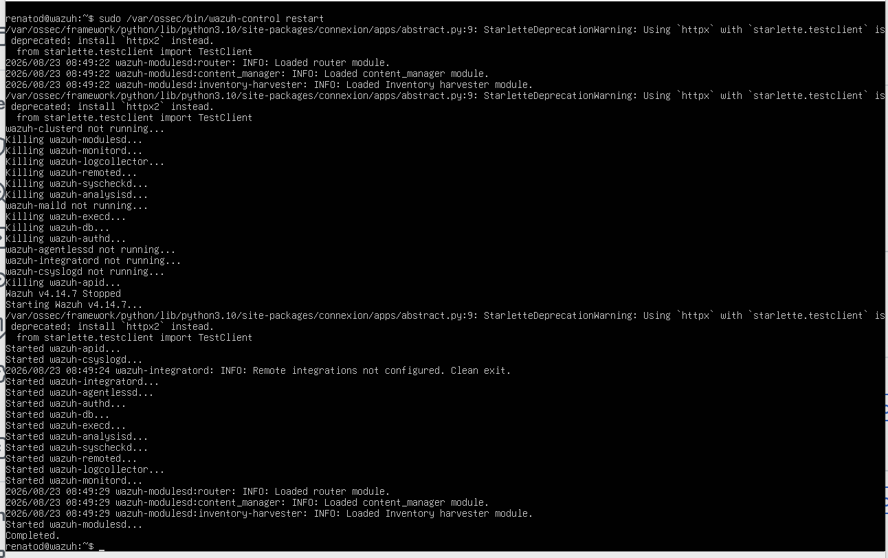

**6. Verify.** Trigger any activity in the org (or click "Redeliver" on the ping event from GitHub's webhook delivery log), then check the manager:

```bash
sudo grep -i github /var/ossec/logs/alerts/alerts.log
```

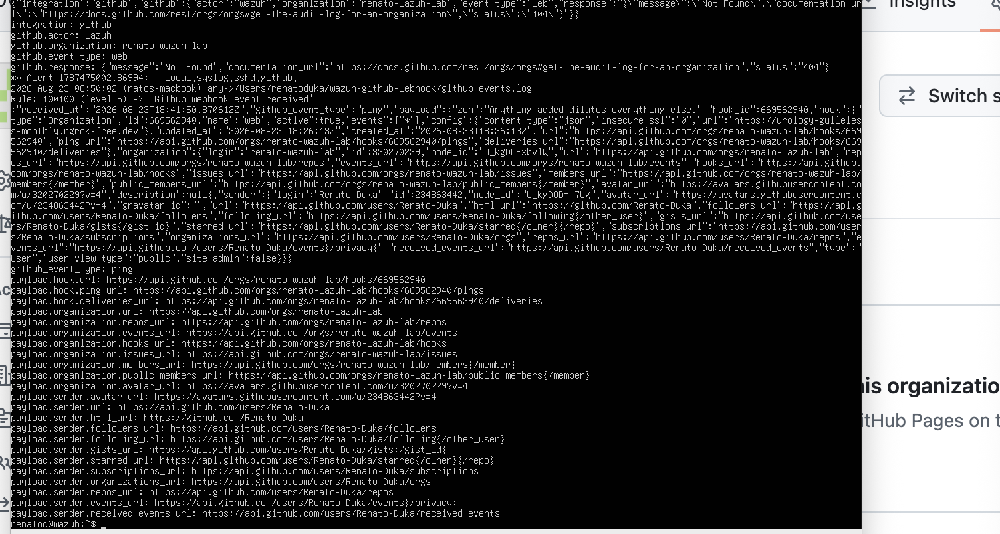

...and in the dashboard, **Explore → Discover**, search `rule.id:100100`:

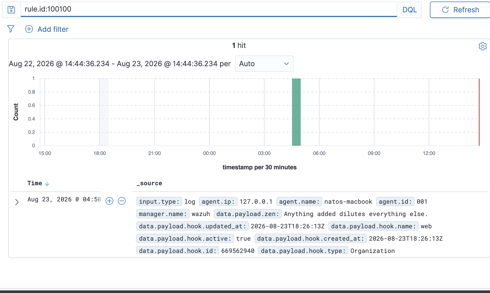

## Troubleshooting notes

**"wazuh-modulesd: ERROR: Unknown module 'github'"** shows up if you try the native module's *old* XML syntax (`<wodle name="github">`). Current Wazuh versions use a dedicated top-level `<github>` block with `<enabled>` instead of `<disabled>`. Moot here since the module still hits the Enterprise Cloud wall regardless of syntax, but worth knowing if you go looking at the built-in module first.

**Events arriving but no alert showing up.** By default, Wazuh only writes to `alerts.log` for events that match a rule at severity level 3 or higher. A JSON localfile with no matching custom rule gets silently processed and dropped, no alert, no error. To confirm data is actually reaching the manager while still debugging a new log source (before a rule exists for it), run `scripts/manager/enable_archiving.sh` and watch `archives.log`, which records everything, alerted or not. Before enabling it, the check comes back empty:

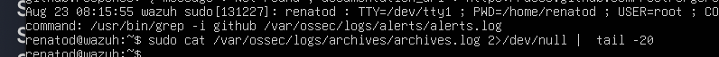

After enabling it and resending an event, the same check confirms delivery:

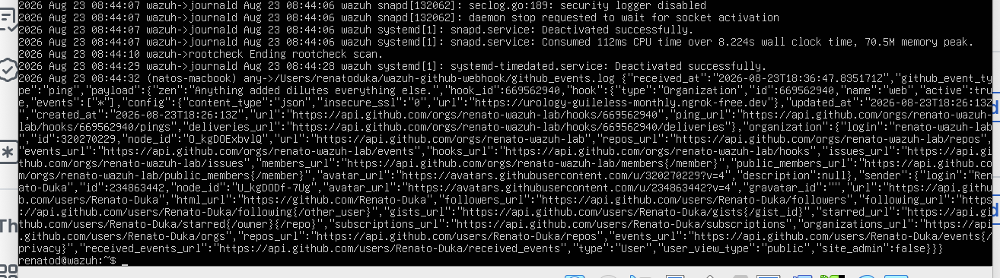

That's what proved the pipeline was working end to end before rule 100100 existed.

**ngrok URLs are ephemeral.** A free ngrok account without a reserved static domain gets a new random URL every time the tunnel restarts. Update the webhook's payload URL (via the GitHub UI or by re-running `create_org_webhook.sh`) whenever the tunnel changes. A reserved static domain (free accounts get one) avoids this.

## Security notes

- No tokens are hardcoded anywhere in these scripts. `GITHUB_TOKEN` and the ngrok authtoken are always supplied by the environment or ngrok's own local config, never committed.
- The webhook has no secret configured in this lab setup (kept simple on purpose). For anything beyond a personal lab, set a webhook secret and verify the `X-Hub-Signature-256` header in the listener before trusting a payload.
- The listener binds to `127.0.0.1` only. It's never directly exposed; ngrok is the only thing that can reach it from outside.

## What this is / isn't

A personal home-lab project built to learn Wazuh's log-collection and rule-writing model hands-on, using GitHub as a real, non-trivial log source, on top of a broader from-scratch SIEM build (VM networking, agent deployment, FIM, vulnerability data). Not production-hardened: no delivery retries beyond what GitHub's webhook redelivery gives you, and the tunnel is a single point of failure. For real production use, this same pattern (webhook → listener → localfile → rule) would move to a proper always-on ingress instead of a personal ngrok tunnel.
